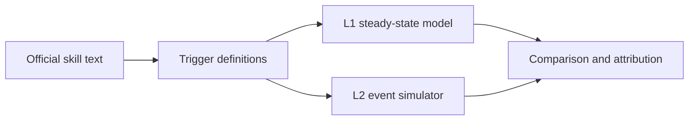

# hsr-mechanic-sim

Honkai: Star Rail combat mechanics, formalized from official skill text into executable trigger definitions, with two independent damage models that check each other.

## Overview

Each character's kit is written as trigger definitions grounded in the official skill descriptions and public datamined parameters. Two models read the same definitions:

- **L1**, a steady-state model that solves for long-run action and resource flows as a linear program (`hsrsim/analytic/`).
- **L2**, an event-driven simulator that plays out the turn order step by step (`hsrsim/simulator/`).

The two are built differently on purpose. When they disagree, the gap is traced back to a specific source, such as a resource rate or a trigger condition, which shows where one of the models or the formalization itself is wrong.

## How the two models check each other



1. **Shared rules.** L1 and L2 load the same trigger specs from `data/hsr/triggers/`, and a fingerprint check confirms that both use identical rules (`examples/l1_l2_crosscheck/run_shared_rule_fingerprint.py`, `tests/test_shared_rules_sp_caps.py`).
2. **Attribution.** For the included Acheron team, the difference between L1 and L2 is broken down by damage source. The results are in `examples/e2e_acheron/`, with a walkthrough in `docs/l1_l2_source_gap.md`.

## Quick start

```bash
python -m venv .venv
# Windows: .venv\Scripts\activate
pip install -r requirements.txt
python examples/l1_l2_crosscheck/run_shared_rule_fingerprint.py
pytest tests/test_shared_rules_sp_caps.py -q
```

## Examples

`examples/e2e_acheron/` holds official skill text for Acheron, the executable character and trigger files used by both models, and frozen L1/L2 comparison output.

## Repository structure

```text
hsrsim/analytic/      L1 steady-state model
hsrsim/simulator/     L2 event simulator
hsrsim/rules/         shared trigger and skill point logic
data/hsr/             characters, triggers and team for the Acheron example
docs/                 trigger design, cross-check and attribution notes, data sources
examples/e2e_acheron/ skill text and model outputs for the Acheron team
examples/l1_l2_crosscheck/
scripts/              helpers for fetching public datamined data
```

## Notes

A small Sparkle talent ParamList file is included so the tests run without the full dataset. Character and trigger files are research formalizations, not official game data.

## Disclaimer

Unofficial fan research code. Not affiliated with HoYoverse or Cognosphere.
