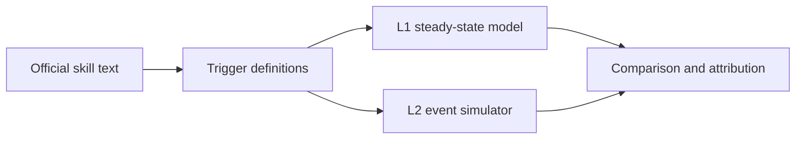

# hsr-mechanic-sim

Honkai: Star Rail combat mechanics, formalized from official skill text into executable trigger definitions, with two independent damage models that check each other.

## Overview

Each character's kit is written as trigger definitions grounded in the official skill descriptions and public datamined parameters. Two models read the same definitions:

- **L1**, a steady-state model that solves for long-run action and resource flows as a linear program (`hsrsim/analytic/`).
- **L2**, an event-driven simulator that plays out the turn order step by step (`hsrsim/simulator/`).

The two are built differently on purpose. When they disagree, the gap is traced back to a specific source, such as a resource rate or a trigger condition, which shows where one of the models or the formalization itself is wrong.

Trigger definitions in this repository are **hand-written formalizations** grounded in official text and public ParamLists, not model-generated kit code.

## How the two models check each other



1. **Shared rules.** L1 and L2 load the same trigger specs from `data/hsr/triggers/`, and a fingerprint check confirms that both use identical rules (`examples/l1_l2_crosscheck/run_shared_rule_fingerprint.py`, `tests/test_shared_rules_sp_caps.py`).
2. **Attribution.** For the included Acheron team, the difference between L1 and L2 is broken down by damage source. The results are in `examples/e2e_acheron/`, with a walkthrough in `docs/l1_l2_source_gap.md`.
3. **Verification workflow.** Evidence grades, triangulation, residual attribution, and upgrade rules: `docs/workflow.md`. Locked S1/S2 calibration notes: `docs/locked_calibration.md`.

## Quick start

```bash
python -m venv .venv
# Windows: .venv\Scripts\activate
pip install -r requirements.txt
python examples/l1_l2_crosscheck/run_shared_rule_fingerprint.py
pytest tests/ -q
```

## Locked calibration (Acheron line)

Main numbers quote **S1+S2 on** (Jiaoqiu Hearth Kindle + Sparkle Artificial Flower), guide speeds Sparkle 161 / support 160 / Acheron 101, L2 horizon 100 cycles where noted.

| Metric | pre-S | S-on |
|---|---:|---:|
| E1.5 Pela→Jiaoqiu, zone on | +5.53% | +7.80% |
| E1.5, zone off | −0.53% | +1.73% |

Frozen lock file: `examples/e2e_acheron/frozen_outputs/locked_calibration_S_on.json`.  
Older pre-S L1/L2 gap dump: `l1_l2_source_gap_results_pre_S.json`. Details: `docs/locked_calibration.md`.

## Examples

| Path | What it shows |
|---|---|
| `examples/e2e_acheron/` | Skill text, team files, frozen L1/L2 attribution |
| `examples/rotation_search_acheron/` | Adaptive cycle-axis search vs community axes |
| `examples/replacement_gain/` | E1.5 (Pela→Jiaoqiu) and Mortenax Blade replacement lifts |
| `examples/l1_l2_crosscheck/` | Shared-rule fingerprint |

## Fribbels zone anchor

Solo Acheron skill damage is checked against Fribbels Optimizer zone stacking with a **≤3%** relative gate. Method and table: `docs/fribbels_zone_anchor.md`. Frozen numbers: `examples/e2e_acheron/frozen_outputs/acheron_fribbels_anchor.json`.

## Heterogeneous graph (kit structure)

Kits compile to a NetworkX heterogeneous graph (zones / skills / state; typed edges). Docs: `docs/heterogeneous_graph.md`. Frozen extraction eval (5 characters, no API key needed): `results/eval_extraction_checkpoint.json` — mean aligned edge F1 **0.705**, mean node F1 **0.749**.

## Repository structure

```text
hsrsim/analytic/      L1 steady-state model
hsrsim/simulator/     L2 event simulator
hsrsim/rules/         shared trigger and skill point logic
hsrsim/rotation/      adaptive cycle-axis enumeration and L1/L2 eval
hsrsim/graph/         heterogeneous kit graph compiler + extract/eval helpers
data/hsr/             characters, triggers and team for the Acheron example
docs/                 workflow, Fribbels anchor, graph, locked calibration
examples/e2e_acheron/ skill text, frozen outputs (incl. S-on lock)
examples/rotation_search_acheron/
examples/replacement_gain/
examples/l1_l2_crosscheck/
scripts/              helpers for fetching public datamined data
tests/                CI smoke tests for rules, rotation, graph, Fribbels freeze
```

## Roadmap

Planned follow-ups (not claimed as completed results):

- Memory-team / Remembrance line formalization and L1–L2 checks
- Robin: Summeretto (知更鸟•晴歌) kit + rotation coverage
- A second game title using the same L1/L2 + graph formalization pattern

## Notes

A small Sparkle talent ParamList file is included so the tests run without the full dataset. Character and trigger files are research formalizations, not official game data.

## License

License text to be confirmed (prefer MIT for alignment with related public HSR tooling; pending collaborator sign-off before tagging a release).

## Disclaimer

Unofficial fan research code. Not affiliated with HoYoverse or Cognosphere.
